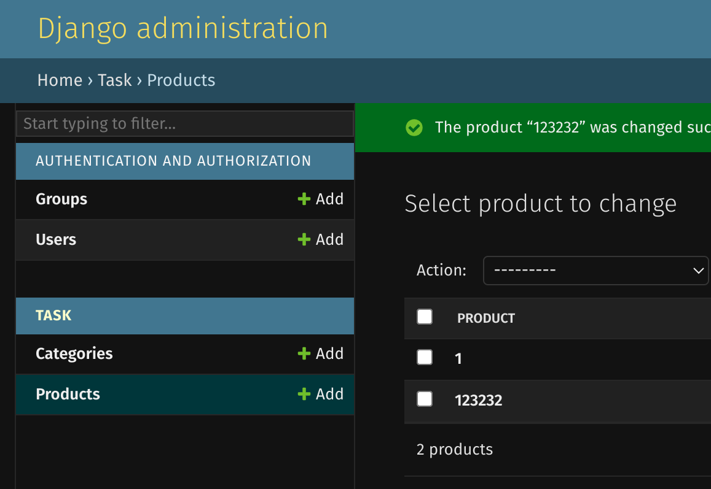

# Base django app 

## This app has three endpoins

* ### products/
        this endpoint displays all objects titles
        from Produsct tabe in our database
    

* ### products/slug/
        this endpoint displays data
        about spesific object in Product table
        which slug is same as in url
    

* ### admin/
        base django url for admin panel
    
